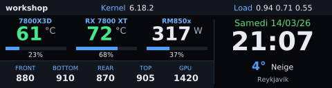

# thermaltaked

[](https://github.com/GregDuhamel/thermaltaked/actions/workflows/ci.yml)

Rust driver and dashboard daemon for the Thermaltake 3.9" bar LCD
(`264a:233d`, 480x128) on Linux. It talks to the panel through hidraw, with no
libusb or vendor software.

## What it shows

The dashboard: hostname, kernel, load average, CPU and GPU temperature and
usage, fan speeds, the power drawn from the supply, the date and time, and the
current weather (Open-Meteo).



While something is playing, the panel is given over to it, cover art included.
Any player that speaks MPRIS will do — Deezer, Spotify, a browser, a local
player:


While the monitors are off or the session is locked, it shows the date and the
time, and nothing else:


A player that is playing wins over both of the others, since music playing is a
sign someone is listening.

| It draws | When |
|---|---|
| the player | any MPRIS player reports `Playing` |
| the clock | every monitor reports `dpms` off, or logind reports the session locked |
| the dashboard | the rest of the time |

The three screenshots above are real 480x128 frames, rendered from invented
readings by `cargo run --example demo_frame`.

## Setup

The panel's two HID interfaces belong to root until a udev rule hands them to
the logged-in user:

```sh
sudo cp udev/70-thermaltake-lcd.rules /etc/udev/rules.d/
sudo udevadm control --reload-rules && sudo udevadm trigger
```

Then take the binary from the [latest release](https://github.com/GregDuhamel/thermaltaked/releases/latest),
or build it:

```sh
cargo install --path .
mkdir -p ~/.config/thermaltaked
cp config.example.toml ~/.config/thermaltaked/config.toml
```

As a user service:

```sh
cp systemd/thermaltaked.service ~/.config/systemd/user/
systemctl --user enable --now thermaltaked
```

## Usage

```sh
thermaltaked info                   # panel, permissions and screen state
thermaltaked test                   # color bars
thermaltaked image photo.png        # any image, scaled and cropped
thermaltaked brightness 60
thermaltaked preview out.png        # a dashboard frame, without the panel
thermaltaked preview --clock out.png
thermaltaked run                    # the daemon
```

## Configuration

Everything in `config.example.toml` is optional. Without a configuration file
the hardware is detected on its own and the weather is left out.

| Key | Does |
|---|---|
| `refresh_seconds` | seconds between frames, kept within 0.1 and 2 |
| `brightness` | backlight, 0 to 100 |
| `font_regular`, `font_bold` | any TrueType files |
| `clock_when_away` | fall back to the clock while nobody is watching |
| `show_player` | give the panel over to whatever is playing |
| `psu_rating` | the supply's wattage, read from its model name when unset |
| `[weather]` | the city to look up, and how often |
| `[names]` | gauge titles, detected from the hardware when unset |
| `[fans]` | which fans to show, in which order, under which names |

The panel returns to its own screen when a few seconds pass without a frame,
which is why `refresh_seconds` goes no higher than two.

## How it reads the machine

Temperatures, fan speeds and the power draw come from `/sys/class/hwmon`, the
load average and CPU usage from `/proc`, and the GPU's name from libdrm's
table. Monitors are asleep when every enabled connector under
`/sys/class/drm` reports `dpms` off. The session lock comes from logind's
`LockedHint`, and the track from MPRIS on the session bus — both over D-Bus,
and both looked up again if the bus is not there yet at boot.

## Protocol

Interface 0 takes 440-byte commands `[opcode, 01, 00, 80, ...]`: a handshake
(`85 87 85 87 84 81`), brightness (`12`, value in byte 4) and a heartbeat (`82`)
every 2 s. Interface 1 takes a JPEG split into 1020-byte chunks, each in a
1024-byte report: `[08, packet count, 00, 80]` for the first, `[08, index, 00,
00]` for the rest. See `src/protocol.rs`.

What is known of it comes from
[ttlcd](https://github.com/bekindpleaserewind/ttlcd),
[Tower-500-LCD-Controller](https://github.com/JohnathanKong/Tower-500-LCD-Controller)
and [thermaltake-lcd-linux](https://github.com/pcmx1/thermaltake-lcd-linux),
which this project reimplements in Rust rather than copies.

## Releasing

Bump `version` in `Cargo.toml` through a pull request, then run the Release
workflow: it tags that version, builds the binary and publishes it with the
udev rule, the service unit and the example configuration.

## License

GPL-3.0-or-later, see [LICENSE](LICENSE). `ttlcd`, where the protocol was first
described, is GPL-3.0.
