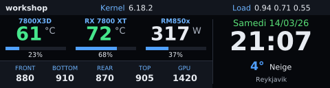

# thermaltaked

[](https://github.com/GregDuhamel/thermaltaked/actions/workflows/ci.yml)

Rust driver and dashboard daemon for the Thermaltake 3.9" bar LCD
(`264a:233d`, 480x128) on Linux. It talks to the panel through the kernel's
hidraw nodes, with no libusb or vendor software, and without a line of
`unsafe`.

## What it shows

The dashboard: hostname, kernel, load average, CPU temperature, GPU junction
temperature, CPU and GPU usage, fan speeds, the power drawn from the supply, the date and time, and the
current weather (Open-Meteo).



While something is playing, the panel is given over to it, cover art included.
Any player that speaks MPRIS will do — Deezer, Spotify, a browser, a local
player:


While the monitors are off or the session is locked, it shows the date and the
time, and nothing else:


A player that is playing wins over both of the others, since music playing is a
sign someone is listening.

| It draws | When |
|---|---|
| the player | any MPRIS player reports `Playing` |
| the clock | every monitor reports `dpms` off, or logind reports the session locked |
| the dashboard | the rest of the time |

The three screenshots above are real 480x128 frames, rendered from invented
readings by `cargo run --example demo_frame`.

## Setup

The binary lives in `/usr/local/bin`, the udev rule in `/etc/udev/rules.d`,
and the service unit and the configuration under `~/.config`. The Makefile
does each step and refuses to run as the wrong user: `cargo` never runs under
`sudo`, and the user unit is never installed by root.

```sh
make build                              # cargo build --release --locked
sudo make install install-udev          # /usr/local/bin/thermaltaked, the udev rule
make install-config                     # ~/.config/thermaltaked/config.toml, kept if present
make install-unit                       # the user unit, enabled and started
```

Building takes Rust 1.89 or later. The release profile strips the binary,
links it with thin LTO and aborts on panic, so a bug ends the process and
systemd restarts it rather than leaving a half-dead daemon on the panel.
`make check` runs what CI runs: fmt, check, clippy, the tests and the docs.

The udev rule hands the panel's two HID interfaces, which belong to root, to
the logged-in user; `thermaltaked info` says whether it took. `make
install-unit` restarts a running service, so it is also how a new binary is
taken up after another `make build && sudo make install`. `make uninstall`,
`uninstall-udev` and `uninstall-unit` take each piece out again.

### From a release

The [latest release](https://github.com/GregDuhamel/thermaltaked/releases/latest)
carries `thermaltaked-x86_64-linux`, a statically linked binary that runs on
any x86_64 distribution whatever its glibc, with the udev rule, the service
unit, the example configuration and a `SHA256SUMS` file. Check the sums,
then put each file where the Makefile would:

```sh
sha256sum --check --ignore-missing SHA256SUMS
sudo install -Dm 0755 thermaltaked-x86_64-linux /usr/local/bin/thermaltaked
sudo install -Dm 0644 70-thermaltake-lcd.rules /etc/udev/rules.d/70-thermaltake-lcd.rules
sudo udevadm control --reload-rules && sudo udevadm trigger --subsystem-match=hidraw
install -Dm 0644 config.example.toml ~/.config/thermaltaked/config.toml
install -Dm 0644 thermaltaked.service ~/.config/systemd/user/thermaltaked.service
systemctl --user daemon-reload && systemctl --user enable --now thermaltaked
```

`--ignore-missing` lets `sha256sum` check whichever of the assets were
downloaded. The binary brings its own libc but no fonts: those stay the
distribution's, see below.

`cargo install --path .` is the alternative: the binary then sits in
`~/.cargo/bin`, and the unit's `ExecStart` is changed to its commented
`%h/.cargo/bin/thermaltaked run` line before it is enabled.

### Fonts and the session

The dashboard is drawn in DejaVu Sans, which most distributions ship
(`dejavu-sans-fonts` on Fedora, `fonts-dejavu-core` on Debian and Ubuntu,
`ttf-dejavu` on Arch) and which is looked for in each one's font directory.
Any other TrueType files can be named in the configuration instead.

The unit's `Environment=RUST_LOG=info` line picks the log level. It starts
with the graphical session, once the panel is the user's to open, and stops
with it. That takes a desktop which reaches `graphical-session.target`, as
GNOME and Plasma do; elsewhere, set `WantedBy=default.target` instead.

## Usage

```sh
thermaltaked info                   # panel, permissions and screen state
thermaltaked test                   # color bars
thermaltaked image photo.png        # any image, scaled and cropped
thermaltaked brightness 60
thermaltaked preview out.png        # a dashboard frame, without the panel
thermaltaked preview --clock out.png
thermaltaked run                    # the daemon
thermaltaked -v run                 # the same, logging at the debug level
```

Logging goes to stderr at the info level: screen changes, the panel coming
and going, sensors found or lost. `-v` adds the debug level and `-vv` the
trace level, for this crate only; `RUST_LOG` picks any level or module
(`RUST_LOG=thermaltaked::player=debug`) when `-v` is not given. Under
systemd, where the journal timestamps every line already, the lines carry
journald priorities instead, so `journalctl --user -u thermaltaked -p warning`
shows only what went wrong. The service unit sets `RUST_LOG=info`.

## Configuration

Everything in `config.example.toml` is optional. Without a configuration file
the hardware is detected on its own and the weather is left out.

| Key | Does |
|---|---|
| `refresh_seconds` | seconds between frames, kept within 0.1 and 2 |
| `brightness` | backlight, 0 to 100 |
| `font_regular`, `font_bold` | any TrueType files; the distribution's DejaVu Sans when unset |
| `clock_when_away` | fall back to the clock while nobody is watching |
| `show_player` | give the panel over to whatever is playing |
| `psu_rating` | the supply's wattage, read from its model name when unset |
| `[weather]` | the city to look up, and how often |
| `[names]` | gauge titles, detected from the hardware when unset |
| `[fans]` | which fans to show (six at most), in which order, under which names |

The panel returns to its own screen when a few seconds pass without a frame,
which is why `refresh_seconds` goes no higher than two.

## How it reads the machine

Temperatures, fan speeds and the power draw come from `/sys/class/hwmon`, the
load average and CPU usage from `/proc`, and the GPU's name from libdrm's
table. Monitors are asleep when every enabled connector under
`/sys/class/drm` reports `dpms` off. The session lock comes from logind's
`LockedHint`, and the track from MPRIS on the session bus — both over D-Bus,
and both looked up again if the bus is not there yet at boot.

The hwmon tree is walked once at start and again when it changes under the
daemon: amdgpu registers its chip anew after a GPU reset or a resume from
sleep, a power supply plugged back in takes another number, a driver loaded
later brings a chip that was not there. A reading whose file is gone has the
tree walked again 5 s after the last walk, and a sensor never found is looked
for every 30 s; the log says what was found, moved or lost.

## Architecture

One thread draws, and never waits on anything slower than a file in sysfs:
left a few seconds without a frame, the panel drops to its own screen. So
whatever comes from the network or from D-Bus is read by a thread of its own,
which publishes its latest result in a shared slot (`Background<T>` in
`src/background.rs`), and the drawing loop reads only that.

| Thread | Reads | Publishes | Pace |
|---|---|---|---|
| main | sysfs, `/proc`, the slots below; writes to the panel | | `refresh_seconds`, 0.1 to 2 s |
| `mpris` | `ListNames`, then `GetAll` on every `org.mpris.MediaPlayer2.*` | the first player that is playing, with the time it was read | every second, or sooner on a `PropertiesChanged` from a player |
| `logind` | the session's `LockedHint` | whether the session is locked | every second, or sooner on a `PropertiesChanged` from the session |
| `weather` | Open-Meteo | the current weather | `refresh_minutes` |
| `cover art` | the cover of the track just asked for | that cover, scaled | on request |
| heartbeat | | | every 2 s, to the panel |

The two D-Bus threads each have a listener thread beside them that turns the
signals of interest into nudges, which they wait for with a timeout; so a
track change shows up at once, and the position moves along on its own
between two readings. Every D-Bus call carries a 2 s timeout: a player that
keeps its name on the bus but answers nothing (a frozen browser tab, an
application stopped with `SIGSTOP`) costs the `mpris` thread that timeout once,
then is left alone for 30 s, and costs the panel nothing. What a thread cannot
be protected from is a bus whose connection handshake hangs: that holds the
thread, not the drawing loop, and the panel keeps drawing with the last state
published. A bus that is not there yet, or a session logind does not know, is
tried again every 30 s and complained about once.

## How it talks to the panel

The transport is the [hidraw](https://github.com/GregDuhamel/hidraw) crate,
shared with the other daemons of this account; this project keeps only the
panel's side of it (`src/device.rs`, `src/lcd.rs`):

- `hidraw::discover` lists `/sys/class/hidraw`, keeping the nodes whose HID
  device sits on USB with the panel's vendor and product IDs. The panel is a
  composite device with one node per interface, and sysfs's
  `bInterfaceNumber` tells the command interface (0) from the frame
  interface (1). The same IDs on another bus would be something else wearing
  them, and are left alone.
- Each node is opened read-write, which the udev rule above allows. Every
  report goes out as one `write(2)` with a zero report-ID byte in front, as
  hidraw wants for a device that declares none.
- The panel answers each command, and each frame, with an input report whose
  content nothing reads: the daemon drains what is queued, sends, then waits
  for the acknowledgement with `poll(2)` and a 2 s timeout, taken up again
  with the time left when a signal cuts it short.
- `hidraw::is_gone` tells an unplugged panel (`ENODEV` on write, `EIO` on
  read) from a transfer that merely failed. Either way the daemon lets the
  panel go and opens it again 3 s later - an unplugged one is found once it
  is back, a silent one is woken by a new handshake - but the log says which.

A heartbeat thread keeps the panel awake every 2 s; should it stop taking
them, the thread ends and the main loop reconnects even before a frame fails.

## Protocol

Interface 0 takes 440-byte commands `[opcode, 01, 00, 80, ...]`: a handshake
(`85 87 85 87 84 81`), brightness (`12`, value in byte 4), which follows the
handshake straight away so the panel does not flash at its last setting, and a
heartbeat (`82`) every 2 s. Interface 1 takes a JPEG split into 1020-byte
chunks, each in a 1024-byte report: `[08, packet count, 00, 80]` for the
first, `[08, index, 00, 00]` for the rest. See `src/protocol.rs`.

What is known of it comes from
[ttlcd](https://github.com/bekindpleaserewind/ttlcd),
[Tower-500-LCD-Controller](https://github.com/JohnathanKong/Tower-500-LCD-Controller)
and [thermaltake-lcd-linux](https://github.com/pcmx1/thermaltake-lcd-linux),
which this project reimplements in Rust rather than copies.

## Releasing

Bump `version` in `Cargo.toml` and add the version's section to
[CHANGELOG.md](CHANGELOG.md) through a pull request, then run the Release
workflow: it tags that version, builds the binary for
`x86_64-unknown-linux-musl`, checks that it is static and draws a frame, and
publishes it with the udev rule, the service unit, the example configuration
and their `SHA256SUMS`.

## License

GPL-3.0-or-later, see [LICENSE](LICENSE). `ttlcd`, where the protocol was first
described, is GPL-3.0.
